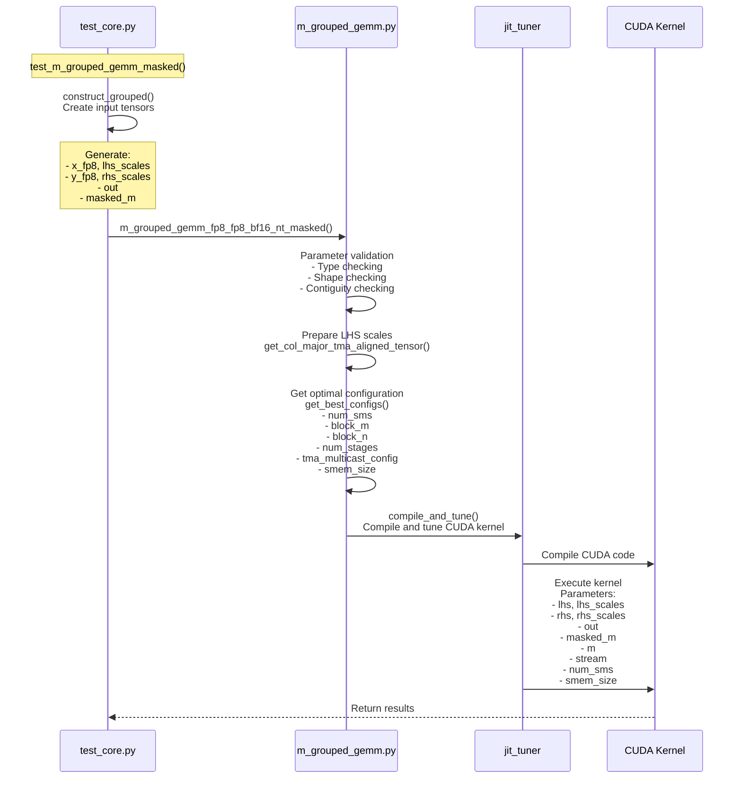

## deepgemm.m_grouped_gemm_fp8_fp8_bf16_nt_masked

```mermaid
sequenceDiagram
    participant Test as test_core.py
    participant GEMM as m_grouped_gemm.py
    participant JIT as jit_tuner
    participant CUDA as CUDA Kernel

    Note over Test: test_m_grouped_gemm_masked()
    
    Test->>Test: construct_grouped()<br/>Create input tensors
    Note over Test: Generate:<br/>- x_fp8, lhs_scales<br/>- y_fp8, rhs_scales<br/>- out<br/>- masked_m
    
    Test->>GEMM: m_grouped_gemm_fp8_fp8_bf16_nt_masked()
    
    GEMM->>GEMM: Parameter validation<br/>- Type checking<br/>- Shape checking<br/>- Contiguity checking
    
    GEMM->>GEMM: Prepare LHS scales<br/>get_col_major_tma_aligned_tensor()
    
    GEMM->>GEMM: Get optimal configuration<br/>get_best_configs()<br/>- num_sms<br/>- block_m<br/>- block_n<br/>- num_stages<br/>- tma_multicast_config<br/>- smem_size
    
    GEMM->>JIT: compile_and_tune()<br/>Compile and tune CUDA kernel
    
    JIT->>CUDA: Compile CUDA code
    
    JIT->>CUDA: Execute kernel<br/>Parameters:<br/>- lhs, lhs_scales<br/>- rhs, rhs_scales<br/>- out<br/>- masked_m<br/>- m<br/>- stream<br/>- num_sms<br/>- smem_size
    
    CUDA-->>Test: Return results
```