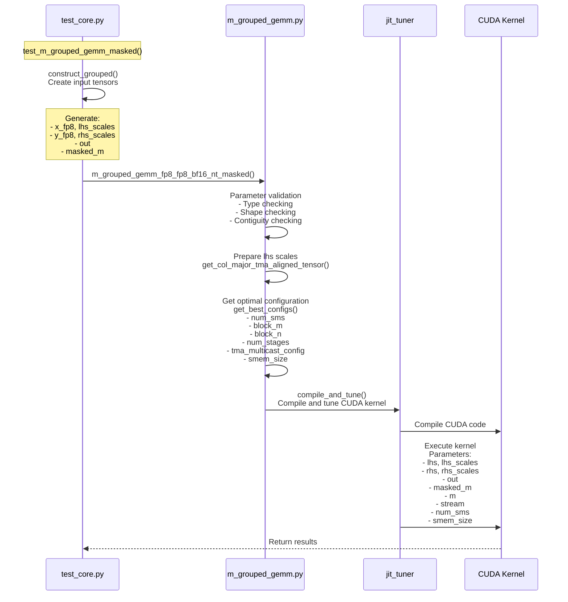

## deepgemm.m_grouped_gemm_fp8_fp8_bf16_nt_masked

### tests/test_core.py:test_m_grouped_gemm_masked


### input/output (example: num_groups(num_local_experts)=4, m(batch_size)=256, n(output_dim, w13)=4096, k(common_dim)=7168)
| Parameter | Type | Shape | Dtype | Description | Example |
|-----------|------|--------|--------|-------------|------------------------------------------------|
| lhs | tuple(torch.Tensor, torch.Tensor) | ([num_groups, m_max, k], [num_groups, m_max, ⌈k/128⌉]) | (torch.float8_e4m3fn, torch.float32) | input & scale | ([4, 256, 7168], [4, 256, 56]) |
| rhs | tuple(torch.Tensor, torch.Tensor) | ([num_groups, n, k], [num_groups, ⌈n/128⌉, ⌈k/128⌉]) | (torch.float8_e4m3fn, torch.float32) | weight & scale | ([4, 4096, 7168], [4, 32, 56]) |
| out | torch.Tensor | [num_groups, m_max, n] | torch.bfloat16 | output | [4, 256, 4096] |
| masked_m | torch.Tensor | [num_groups] | torch.int32 | actual rows to compute for each group | [4] |
| expected_m | scalar on CPU | - | int | hint for M dimension expectation | min(mean(masked_m) + 1, m) |

```python
Testing grouped masked GEMM:
>>>[0]: x_fp8=(torch.Size([4, 256, 7168]), torch.Size([4, 256, 56])), y_fp8=(torch.Size([4, 4096, 7168]), torch.Size([4, 32, 56])), out=torch.Size([4, 256, 4096]), masked_m=torch.Size([4])
    group [0]: masked_m[0]=256
    group [1]: masked_m[1]=256
    group [2]: masked_m[2]=64
    group [3]: masked_m[3]=192
expected_m=193
>>>[1]: x_fp8=(torch.Size([4, 256, 7168]), torch.Size([4, 256, 56])), y_fp8=(torch.Size([4, 4096, 7168]), torch.Size([4, 32, 56])), out=torch.Size([4, 256, 4096]), masked_m=torch.Size([4])
    group [0]: masked_m[0]=256
    group [1]: masked_m[1]=256
    group [2]: masked_m[2]=192
    group [3]: masked_m[3]=256
expected_m=241
>>>[2]: x_fp8=(torch.Size([4, 256, 7168]), torch.Size([4, 256, 56])), y_fp8=(torch.Size([4, 4096, 7168]), torch.Size([4, 32, 56])), out=torch.Size([4, 256, 4096]), masked_m=torch.Size([4])
    group [0]: masked_m[0]=192
    group [1]: masked_m[1]=128
    group [2]: masked_m[2]=128
    group [3]: masked_m[3]=192
expected_m=161
>>>[3]: x_fp8=(torch.Size([4, 256, 7168]), torch.Size([4, 256, 56])), y_fp8=(torch.Size([4, 4096, 7168]), torch.Size([4, 32, 56])), out=torch.Size([4, 256, 4096]), masked_m=torch.Size([4])
    group [0]: masked_m[0]=128
    group [1]: masked_m[1]=64
    group [2]: masked_m[2]=192
    group [3]: masked_m[3]=128
expected_m=129
>>>[4]: x_fp8=(torch.Size([4, 256, 7168]), torch.Size([4, 256, 56])), y_fp8=(torch.Size([4, 4096, 7168]), torch.Size([4, 32, 56])), out=torch.Size([4, 256, 4096]), masked_m=torch.Size([4])
    group [0]: masked_m[0]=192
    group [1]: masked_m[1]=64
    group [2]: masked_m[2]=64
    group [3]: masked_m[3]=192
expected_m=129
>>>[5]: x_fp8=(torch.Size([4, 256, 7168]), torch.Size([4, 256, 56])), y_fp8=(torch.Size([4, 4096, 7168]), torch.Size([4, 32, 56])), out=torch.Size([4, 256, 4096]), masked_m=torch.Size([4])
    group [0]: masked_m[0]=256
    group [1]: masked_m[1]=64
    group [2]: masked_m[2]=192
    group [3]: masked_m[3]=256
expected_m=193
>>>[6]: x_fp8=(torch.Size([4, 256, 7168]), torch.Size([4, 256, 56])), y_fp8=(torch.Size([4, 4096, 7168]), torch.Size([4, 32, 56])), out=torch.Size([4, 256, 4096]), masked_m=torch.Size([4])
    group [0]: masked_m[0]=192
    group [1]: masked_m[1]=128
    group [2]: masked_m[2]=256
    group [3]: masked_m[3]=256
expected_m=209
>>>[7]: x_fp8=(torch.Size([4, 256, 7168]), torch.Size([4, 256, 56])), y_fp8=(torch.Size([4, 4096, 7168]), torch.Size([4, 32, 56])), out=torch.Size([4, 256, 4096]), masked_m=torch.Size([4])
    group [0]: masked_m[0]=192
    group [1]: masked_m[1]=64
    group [2]: masked_m[2]=64
    group [3]: masked_m[3]=64
expected_m=97
>>>[8]: x_fp8=(torch.Size([4, 256, 7168]), torch.Size([4, 256, 56])), y_fp8=(torch.Size([4, 4096, 7168]), torch.Size([4, 32, 56])), out=torch.Size([4, 256, 4096]), masked_m=torch.Size([4])
    group [0]: masked_m[0]=256
    group [1]: masked_m[1]=64
    group [2]: masked_m[2]=256
    group [3]: masked_m[3]=192
expected_m=193
>>>[9]: x_fp8=(torch.Size([4, 256, 7168]), torch.Size([4, 256, 56])), y_fp8=(torch.Size([4, 4096, 7168]), torch.Size([4, 32, 56])), out=torch.Size([4, 256, 4096]), masked_m=torch.Size([4])
    group [0]: masked_m[0]=128
    group [1]: masked_m[1]=192
    group [2]: masked_m[2]=64
    group [3]: masked_m[3]=128
expected_m=129


 > Performance (num_groups=4, m_per_group= 256, n=4096, k=7168):  239 us | throughput:  252 TFLOPS,  557 GB/s
>>>[0]: x_fp8=(torch.Size([4, 256, 2048]), torch.Size([4, 256, 16])), y_fp8=(torch.Size([4, 7168, 2048]), torch.Size([4, 56, 16])), out=torch.Size([4, 256, 7168]), masked_m=torch.Size([4])
    group [0]: masked_m[0]=128
    group [1]: masked_m[1]=128
    group [2]: masked_m[2]=128
    group [3]: masked_m[3]=256
expected_m=161
>>>[1]: x_fp8=(torch.Size([4, 256, 2048]), torch.Size([4, 256, 16])), y_fp8=(torch.Size([4, 7168, 2048]), torch.Size([4, 56, 16])), out=torch.Size([4, 256, 7168]), masked_m=torch.Size([4])
    group [0]: masked_m[0]=64
    group [1]: masked_m[1]=64
    group [2]: masked_m[2]=192
    group [3]: masked_m[3]=256
expected_m=145
>>>[2]: x_fp8=(torch.Size([4, 256, 2048]), torch.Size([4, 256, 16])), y_fp8=(torch.Size([4, 7168, 2048]), torch.Size([4, 56, 16])), out=torch.Size([4, 256, 7168]), masked_m=torch.Size([4])
    group [0]: masked_m[0]=64
    group [1]: masked_m[1]=192
    group [2]: masked_m[2]=192
    group [3]: masked_m[3]=64
expected_m=129
>>>[3]: x_fp8=(torch.Size([4, 256, 2048]), torch.Size([4, 256, 16])), y_fp8=(torch.Size([4, 7168, 2048]), torch.Size([4, 56, 16])), out=torch.Size([4, 256, 7168]), masked_m=torch.Size([4])
    group [0]: masked_m[0]=192
    group [1]: masked_m[1]=128
    group [2]: masked_m[2]=192
    group [3]: masked_m[3]=256
expected_m=193
>>>[4]: x_fp8=(torch.Size([4, 256, 2048]), torch.Size([4, 256, 16])), y_fp8=(torch.Size([4, 7168, 2048]), torch.Size([4, 56, 16])), out=torch.Size([4, 256, 7168]), masked_m=torch.Size([4])
    group [0]: masked_m[0]=64
    group [1]: masked_m[1]=256
    group [2]: masked_m[2]=192
    group [3]: masked_m[3]=128
expected_m=161
>>>[5]: x_fp8=(torch.Size([4, 256, 2048]), torch.Size([4, 256, 16])), y_fp8=(torch.Size([4, 7168, 2048]), torch.Size([4, 56, 16])), out=torch.Size([4, 256, 7168]), masked_m=torch.Size([4])
    group [0]: masked_m[0]=192
    group [1]: masked_m[1]=128
    group [2]: masked_m[2]=128
    group [3]: masked_m[3]=128
expected_m=145
>>>[6]: x_fp8=(torch.Size([4, 256, 2048]), torch.Size([4, 256, 16])), y_fp8=(torch.Size([4, 7168, 2048]), torch.Size([4, 56, 16])), out=torch.Size([4, 256, 7168]), masked_m=torch.Size([4])
    group [0]: masked_m[0]=64
    group [1]: masked_m[1]=192
    group [2]: masked_m[2]=256
    group [3]: masked_m[3]=64
expected_m=145
>>>[7]: x_fp8=(torch.Size([4, 256, 2048]), torch.Size([4, 256, 16])), y_fp8=(torch.Size([4, 7168, 2048]), torch.Size([4, 56, 16])), out=torch.Size([4, 256, 7168]), masked_m=torch.Size([4])
    group [0]: masked_m[0]=64
    group [1]: masked_m[1]=128
    group [2]: masked_m[2]=128
    group [3]: masked_m[3]=64
expected_m=97
>>>[8]: x_fp8=(torch.Size([4, 256, 2048]), torch.Size([4, 256, 16])), y_fp8=(torch.Size([4, 7168, 2048]), torch.Size([4, 56, 16])), out=torch.Size([4, 256, 7168]), masked_m=torch.Size([4])
    group [0]: masked_m[0]=64
    group [1]: masked_m[1]=256
    group [2]: masked_m[2]=192
    group [3]: masked_m[3]=128
expected_m=161
>>>[9]: x_fp8=(torch.Size([4, 256, 2048]), torch.Size([4, 256, 16])), y_fp8=(torch.Size([4, 7168, 2048]), torch.Size([4, 56, 16])), out=torch.Size([4, 256, 7168]), masked_m=torch.Size([4])
    group [0]: masked_m[0]=128
    group [1]: masked_m[1]=256
    group [2]: masked_m[2]=192
    group [3]: masked_m[3]=256
expected_m=209
```