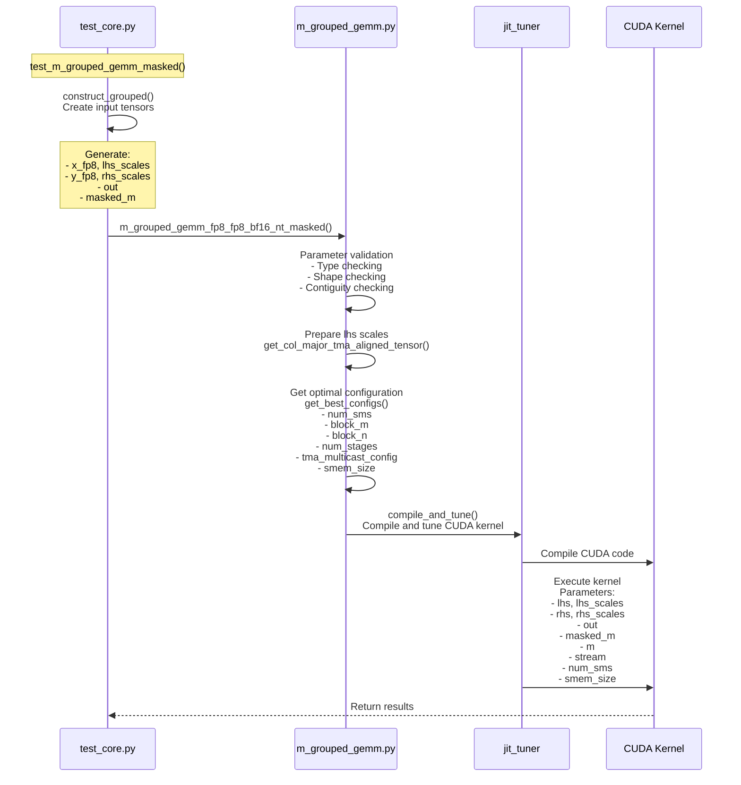

## deepgemm.m_grouped_gemm_fp8_fp8_bf16_nt_masked

### tests/test_core.py:test_m_grouped_gemm_masked

### input/output (example: num_groups=4, m=256, n=2048, k=7168)
| Parameter | Type | Shape | Dtype | Description | Example |
|-----------|------|--------|--------|-------------|------------------------------------------------|
| lhs | Tuple(torch.Tensor, torch.Tensor) | ([num_groups, m_max, k], [num_groups, m_max, ⌈k/128⌉]) | (torch.float8_e4m3fn, torch.float32) | input & scale | ([4, 256, 7168], [4, 256, 56]) |
| rhs | Tuple(torch.Tensor, torch.Tensor) | ([num_groups, n, k], [num_groups, ⌈n/128⌉, ⌈k/128⌉]) | (torch.float8_e4m3fn, torch.float32) | weight & scale | ([4, 2048, 7168], [4, 32, 56]) |
| out | torch.Tensor | [num_groups, m_max, n] | torch.bfloat16 | output | [4, 256, 2048] |
| masked_m | torch.Tensor | [num_groups] | torch.int32 | actual rows to compute for each group | [4] |
| expected_m | int | - | - | hint for M dimension expectation | min(mean(masked_m) + 1, m) |